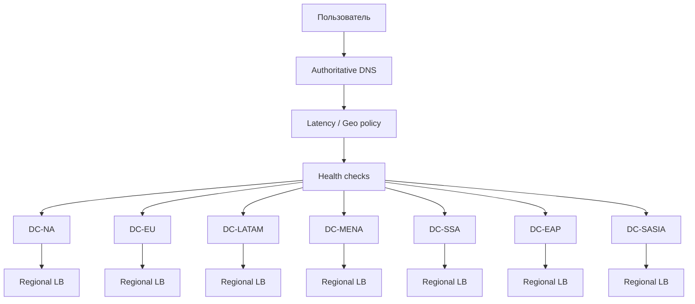
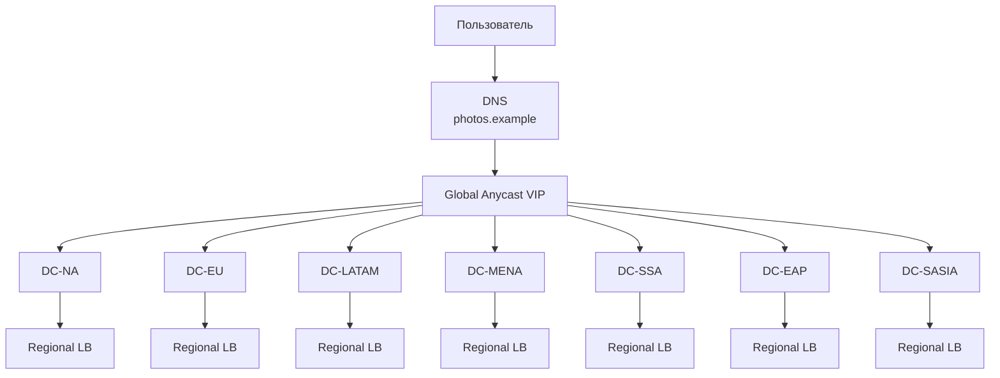
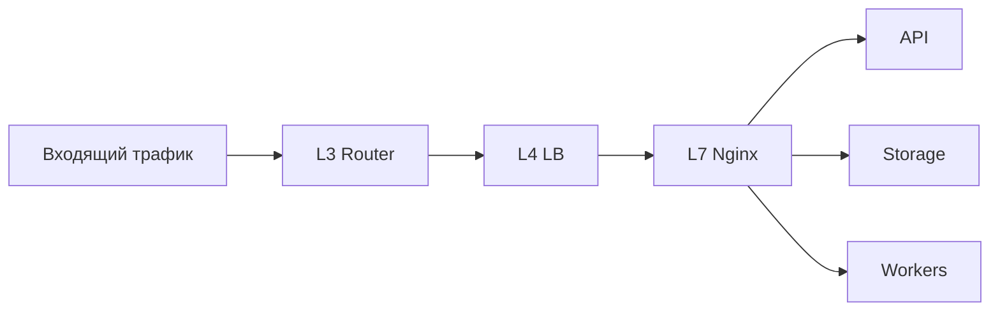

# VK-Highload-Coursework

## 1. Тема и целевая аудитория

> **Тема**: Google Photos

**Аудитория сервиса:**

- По данным Google на май 2025 года, сервис Google Photos достиг _1.5 млрд активных пользователей в месяц_ [^1]. Кроме того, общее количество загружаемых фотографий достигло 6 млрд/день. [^2]

**Функционал MVP:**

Аналог Google Photos будет иметь следующие функции:

- Авторизация
- Загрузка и скачивание фото
- Распознавание лиц на фото
- Поиск по галерее (дата, метаданные о камере, геоданные, лица в кадре)
- Возможность поделиться фото и видео
- Совместные альбомы (например, семейные)
- Уведомления при добавлении фото в совместный альбом

## 2. Расчет нагрузки

### 2.1. Продуктовые метрики:

| Показатель             |      Значение | Расчёт / источник                                                                                                                                                            |
| ---------------------- | ------------: | ---------------------------------------------------------------------------------------------------------------------------------------------------------------------------- |
| MAU                    | **~1.5 млрд** | Google в мае 2025 года сообщала о более чем 1.5 млрд активных пользователей в месяц. [^1]                                                                                    |
| DAU                    |  **~225 млн** | `1.5 млрд * 0,15 = 225 млн`. Коэффициент `DAU / MAU = 0,15` принимается как инженерное допущение на основе опубликованных benchmark-значений stickiness. [^3]                |
| Средний размер галереи | **2795 фото** | Среднестатистический пользователь смартфона хранит около 2795 фотографий в фотоплёнке. Значение используется как приближение среднего размера пользовательской галереи. [^4] |

Значение 2795 фотографий относится к фотоплёнке пользователя смартфона, а не непосредственно к Google Photos. Поэтому в данной работе оно используется как приближённая оценка размера пользовательской галереи. Это позволяет получить независимую проверку порядка необходимого объёма хранения.

#### 2.1.1. Распределение пользователей по регионам

Google не публикует актуальное разбиение аудитории Google Photos по географическим регионам. Поэтому для распределения аудитории проектируемого сервиса используется приближение по распределению пользователей Интернета в 2025 году. По данным World Bank / ITU, собранным и обработанным Our World in Data, в 2025 году в мире было около **6,046 млрд интернет-пользователей**. [^5]

Доли регионов рассчитываются как `Кол-во пользователей интернета в регионе / 6,046 млрд`. Далее предполагается, что доля аудитории Google Photos в каждом регионе примерно пропорциональна доле интернет-пользователей.

| Регион                                                  | Интернет-пользователи, 2025 |      Доля |           MAU |           DAU |   Действия/сутки |
| ------------------------------------------------------- | --------------------------: | --------: | ------------: | ------------: | ---------------: |
| Северная Америка                                        |                     367 млн |  **6,1%** |  **91,5 млн** | **13,73 млн** |    **770,7 млн** |
| Европа и Центральная Азия                               |                     862 млн | **14,3%** | **214,5 млн** | **32,18 млн** |   **1,807 млрд** |
| Латинская Америка и Карибский бассейн                   |                     558 млн |  **9,2%** | **138,0 млн** | **20,70 млн** |   **1,162 млрд** |
| Ближний Восток и Северная Африка, Афганистан и Пакистан |                     527 млн |  **8,7%** | **130,5 млн** | **19,58 млн** |   **1,099 млрд** |
| Африка к югу от Сахары                                  |                     472 млн |  **7,8%** | **117,0 млн** | **17,55 млн** |    **985,5 млн** |
| Восточная Азия и Тихоокеанский регион                   |                   2 110 млн | **34,9%** | **523,5 млн** | **78,53 млн** |   **4,410 млрд** |
| Южная Азия                                              |                   1 150 млн | **19,0%** | **285,0 млн** | **42,75 млн** |   **2,401 млрд** |
| **Итого**                                               |               **6 046 млн** |  **100%** |  **1,5 млрд** |   **225 млн** | **≈13,602 млрд** |

Здесь `Действия/сутки = 13,60225 млрд * доля региона` (п. 2.2). Аналогично можно распределять по регионам отдельные категории нагрузки из таблицы ниже. Такое распределение предполагает одинаковую среднюю активность пользователя во всех регионах. В реальной системе поведение, размер галереи, частота загрузок и доля push-уведомлений могут заметно различаться по регионам.

### 2.2. Среднее кол-во действий пользователя в день

В случаях, когда Google публикует месячное количество активных пользователей для определённого действия, сначала рассчитывается интенсивность действия на одного пользователя, а затем она переносится на выбранную аудиторию проекта.

| Тип действия                    | Среднее количество действий на 1 DAU в день | Как получено                                                                                                                                                                                                                                                                         | Действий в день при 225M DAU |
| ------------------------------- | ------------------------------------------: | ------------------------------------------------------------------------------------------------------------------------------------------------------------------------------------------------------------------------------------------------------------------------------------ | ---------------------------: |
| Авторизация / session           |                                    **1,09** | В исследовании Ubuntu One зафиксировано 42,5 млн пользовательских сессий за 30 дней при 1,294794 млн пользователей: `42,5 млн / 1,294794 млн / 30 ≈ 1,09 сессии/пользователя/день`. Значение используется как ориентир для personal-cloud сервиса. [^6]                              |      `1,09 * 225M = 245,25M` |
| Загрузка фото                   |                                   **26,67** | Google сообщила о более чем 6 млрд загружаемых фото и видео в день. В 2025 году Google Photos имел более 1,5 млрд MAU. Сначала получаем `6 млрд / 1,5 млрд = 4` загрузки на MAU в день, затем переносим показатель на проектируемую аудиторию: `4 * 1,5B / 225M ≈ 26,67`. [^2][^1]   |    `26,67 * 225M ≈ 6,0 млрд` |
| Скачивание фото                 |                                    **5,30** | Для проектируемого сервиса принимается инженерное допущение **~5,3 скачивания/DAU/день** (≈19,9% от действий по загрузке).                                                                                                                                                           |   `5,3 * 225M = 1,1925 млрд` |
| Распознавание лиц на новых фото |                                   **26,67** | Принимается одна фоновая задача распознавания для каждого нового загруженного фото/медиаобъекта: `1 * количество загрузок = 26,67 операции/DAU/день`. Речь идёт об одной задаче обработки фотографии, а не об отдельной операции на каждое найденное лицо.                           |    `26,67 * 225M ≈ 6,0 млрд` |
| Поиск по галерее                |                                   **0,247** | Google сообщила, что более 370 млн пользователей ежемесячно выполняют поиск по своим фото. Для оценки количества запросов принимается одно поисковое действие на одного такого пользователя в месяц: `370M / 1,5B ≈ 0,247`. [^1]                                                     |     `0,247 * 225M = 55,575M` |
| Шеринг                          |                                   **0,293** | Google сообщила, что более 440 млн пользователей ежемесячно делятся своими воспоминаниями. Принимается одно действие шеринга на одного такого пользователя в месяц: `440M / 1,5B ≈ 0,293`. [^1]                                                                                      |     `0,293 * 225M = 65,925M` |
| Создание совместного альбома    |                                   **0,010** | Открытых данных о частоте создания совместных альбомов нет, поэтому принимается сценарное допущение: **1% DAU создают совместный альбом в сутки**. `1% = 0,01` действия/DAU/день.                                                                                                    |        `0,01 * 225M = 2,25M` |
| Добавление в совместный альбом  |                                    **0,10** | При отсутствии открытых данных принимается: **10% DAU выполняют добавление в совместный альбом в сутки**. `10% = 0,10` действия/DAU/день.                                                                                                                                            |        `0,10 * 225M = 22,5M` |
| Просмотр совместного альбома    |                                    **0,20** | При отсутствии открытых данных принимается: **20% DAU выполняют просмотр совместного альбома в сутки**. `20% = 0,20` действия/DAU/день.                                                                                                                                              |          `0,20 * 225M = 45M` |
| Push-уведомления                |                                    **0,30** | Публичных данных Google Photos о числе push-уведомлений нет. Для согласования с нагрузкой совместных альбомов принимается **10% DAU выполняют добавление**, а на одно добавление приходится в среднем **3 получателя** (4 человека в семье): `0,10 * 3 = 0,30` уведомления/DAU/день. |        `0,30 * 225M = 67,5M` |
| **Итого**                       |                                  **≈60,93** |                                                                                                                                                                                                                                                                                      |            **≈13,6966 млрд** |

Таким образом, в среднем один активный пользователь генерирует около **60,45 пользовательских/фоновых операций в сутки** в соответствии с принятой моделью. При 225 млн DAU это составляет примерно **13,60225 млрд операций в сутки**.

### 2.3 Технические метрики:

Для проектируемого сервиса принимаются два уровня подписки:

- бесплатный — **10 GB**;
- платный — **200 GB**.

Исследование All About Cookies показывает, что 62% опрошенных пользователей платят за облачное хранилище. [^7]

Оценочная доля Google в размере **15–19% рынка personal cloud**. [^8]

Для расчёта принимается 62% \* 17% = **10,5% платных пользователей**. Это рассматривается как отдельное инженерное допущение.

Количество пользователей тарифов:

```text
Платные:
1,5 млрд * 10,5% = 157,5 млн пользователей

Бесплатные:
1,5 млрд * 89,5% = 1,3425 млрд пользователей
```

Номинальный логический объём предоставленного пользователям хранилища:

```text
157,5 млн * 200 GB + 1,3425 млрд * 10 GB

= 31,5 млрд GB + 13,425 млрд GB
≈ 44,925 млрд GB
≈ 44,93 EB
```

Полученное значение **44,93 EB** является логической ёмкостью, то есть объёмом, доступным пользователям по тарифам. Для оценки реального физического объёма хранения необходимо учитывать репликацию данных.

Тогда необходимый физический объём для пользовательских данных:

```text
44,93 EB * 3
≈ 134,78 EB
```

Таким образом:

- **логическая ёмкость:** `≈44,93 EB`;
- **физическая ёмкость с учётом 3-кратной репликации:** `≈134,78 EB`.

Полученное значение не включает дополнительные накладные расходы самой storage-системы, такие как служебные метаданные, свободный резерв для восстановления после отказов, временное пространство, версии объектов, thumbnails и индексы, т.к. размеры этих категорий являются погрешностью на фоне размера хранилища для основного контента. Поэтому **134,78 EB следует рассматривать как минимальную оценку физического объёма данных с учётом только трёхкратной репликации**.

Дополнительно можно оценить объём фотографий через средний размер пользовательской галереи:

```text
1,5 млрд пользователей * 2795 фото
≈ 4,1925 трлн фото
```

При среднем размере одного фото около 5 MB:

```text
4,1925 трлн * 5 MB
≈ 20,96 EB
```

С учётом трёхкратной репликации:

```text
20,96 EB * 3
≈ 62,89 EB
```

Эта оценка ниже расчётной ёмкости тарифов `134,78 EB`, поскольку пользователи в среднем не обязаны полностью заполнять выделенные квоты. Поэтому в качестве расчётного верхнего уровня инфраструктуры используется значение, полученное из тарифов.

#### 2.3.1. Пиковый трафик (2х от нормального)

Т.к. у сервиса облачного хранилища практически не бывает пиковых сезонов, кроме праздников, когда множество людей будет делать больше фотографий, будем считать, что пиковый трафик будет превышать средний **в 2 раза**.

В реальности трафик будет более-менее равномерный в виду регионального распределения пользователей, но для большей надежности системы я заложил 2-кратный пик как самый худший и маловероятный, но тем не менее возможный сценарий (например, при изменении условий по подписке, например, больше места в том же тарифе, и большое количество людей за раз оформит подписку и начнет загружать фото).

| Категория                                | Объём пикового трафика | Краткий расчёт                                              |
| ---------------------------------------- | ---------------------: | ----------------------------------------------------------- |
| Upload (входящий)                        |      **~5 556 Гбит/с** | `6 млрд * 5 MB * 8 / 86400 * 2 ≈ 5 556 Гбит/с`              |
| Download + Share / просмотр shared album |      **~1 146 Гбит/с** | `(1,1925 млрд + 45M) * 5 MB * 8 / 86400 * 2 ≈ 1 146 Гбит/с` |
| Служебный трафик                         |        **~132 Гбит/с** | `~66 Гбит/с * 2 ≈ 132 Гбит/с`                               |
| API / поиск / авторизация                |       **~1,61 Гбит/с** | `~314 866 RPS * 0,64 KB * 8 ≈ 1,61 Гбит/с`                  |
| **ИТОГО пиково**                         |      **~6 835 Гбит/с** | `5 556 + 1 146 + 132 + 1,61 ≈ 6 835 Гбит/с`                 |
|                                          |      **≈ 6,84 Тбит/с** |                                                             |

#### 2.3.2. RPS (средний / пиковый)

Средний RPS рассчитывается как:

`RPS_avg = N_day / 86400`

Пиковый RPS:

`RPS_peak = RPS_avg * 2`

| Категория             |   Средний / пиковый RPS | Краткая формула                 |
| --------------------- | ----------------------: | ------------------------------- |
| Авторизация / session |     **~2 839 / ~5 677** | `245,25M / 86400`               |
| Upload                |  **~69 444 / ~138 889** | `6 млрд / 86400`                |
| Download              |   **~13 802 / ~27 604** | `1,1925 млрд / 86400`           |
| Поиск                 |       **~643 / ~1 286** | `55,575M / 86400`               |
| Шеринг                |       **~763 / ~1 526** | `65,925M / 86400`               |
| Совместные альбомы    |       **~807 / ~1 615** | `(2,25M + 22,5M + 45M) / 86400` |
| Уведомления           |       **~781 / ~1 563** | `67,5M / 86400`                 |
| Face recognition      |  **~69 444 / ~138 889** | `6 млрд / 86400`                |
| **Итого**             | **~158 525 / ~317 050** |                                 |

#### 2.3.3. Распределение нагрузки по регионам

Если сохранить принятое допущение, что активность пользователей пропорциональна их региональной доле, то средний и пиковый RPS, а также пиковый сетевой трафик распределяются аналогично.

| Регион                                                  |      Доля |          MAU |         DAU |   Действия/сутки |  Средний RPS |  Пиковый RPS |    Пиковый трафик |
| ------------------------------------------------------- | --------: | -----------: | ----------: | ---------------: | -----------: | -----------: | ----------------: |
| Северная Америка                                        |  **6,1%** |     91,5 млн |   13,73 млн |   **835,49 млн** |   **~9 670** |  **~19 340** |   **~417 Гбит/с** |
| Европа и Центральная Азия                               | **14,3%** |    214,5 млн |   32,18 млн |   **1,959 млрд** |  **~22 669** |  **~45 338** |   **~977 Гбит/с** |
| Латинская Америка и Карибский бассейн                   |  **9,2%** |    138,0 млн |   20,70 млн |   **1,260 млрд** |  **~14 584** |  **~29 168** |   **~629 Гбит/с** |
| Ближний Восток и Северная Африка, Афганистан и Пакистан |  **8,7%** |    130,5 млн |   19,58 млн |   **1,192 млрд** |  **~13 792** |  **~27 583** |   **~595 Гбит/с** |
| Африка к югу от Сахары                                  |  **7,8%** |    117,0 млн |   17,55 млн |   **1,068 млрд** |  **~12 365** |  **~24 730** |   **~533 Гбит/с** |
| Восточная Азия и Тихоокеанский регион                   | **34,9%** |    523,5 млн |   78,53 млн |   **4,780 млрд** |  **~55 325** | **~110 650** | **~2,385 Тбит/с** |
| Южная Азия                                              | **19,0%** |    285,0 млн |   42,75 млн |   **2,602 млрд** |  **~30 120** |  **~60 239** | **~1,299 Тбит/с** |
| **Итого**                                               |  **100%** | **1,5 млрд** | **225 млн** | **≈13,697 млрд** | **~158 524** | **~317 049** |  **~6,84 Тбит/с** |

Краткие формулы:

`Региональный MAU = 1,5B * Доля региона`

`Региональный DAU = 225M * Доля региона`

`Региональные действия/сутки = 13,60225 млрд * Доля региона`

`RPS_avg = 157 433 * Доля региона`

`RPS_peak = 314 866 * Доля региона`

`Traffic_peak = 6 835 Гбит/с * Доля региона`

## 3. Глобальная балансировка

Для сервиса масштаба Google Photos одного локального балансировщика недостаточно: пользователи распределены по всему миру, а основная нагрузка формируется большими объёмами загрузки и скачивания данных.

### 3.1. Функциональное разбиение по доменам

Глобальная балансировка должна учитывать не только географию клиента, но и характер запроса. Поэтому внешний API логически разделяется на несколько доменов:

| Домен                   | Основные операции                             | Политика глобальной балансировки                                                 |
| ----------------------- | --------------------------------------------- | -------------------------------------------------------------------------------- |
| `auth.photos.example`   | Авторизация, refresh session                  | Выбор ближайшего здорового ДЦ                                                    |
| `media.photos.example`  | Upload / Download                             | Привязка к **home-региону пользователя** или доступной реплике данных            |
| `api.photos.example`    | Поиск, метаданные, шеринг, совместные альбомы | Маршрутизация к ДЦ с актуальной репликой метаданных и индексов                   |
| `ai.photos.example`     | Face recognition                              | Асинхронная обработка; очередь задач может перераспределяться между здоровыми ДЦ |
| `notify.photos.example` | Push-уведомления                              | Маршрутизация к ДЦ, обслуживающему получателя; при отказе — failover             |

Такое разделение необходимо, потому что для `media` нельзя безусловно применять правило «отправить запрос в ближайший ДЦ». Если фотография хранится в другом регионе, это приведёт к дополнительному меж-ДЦ трафику и увеличит задержку. Для поиска и совместных альбомов аналогично важно, чтобы запрос попадал к копии индекса или метаданных, согласованной с соответствующим хранилищем.

Для фоновых задач распознавания лиц политика отличается: задача создаётся после загрузки фотографии и помещается в очередь. Обработчик может находиться в исходном ДЦ либо быть перенесён в другой здоровый ДЦ, если там есть свободная вычислительная ёмкость.

### 3.2. Обоснование расположения ДЦ

В качестве базовой схемы принимаются **7 географических ДЦ**, соответствующих региональному распределению нагрузки из раздела «Расчёт нагрузки». Такое разбиение напрямую связано с продуктовой метрикой: доля пользователей региона определяет ожидаемую долю запросов и сетевого трафика. В исходной модели предполагается одинаковая средняя активность пользователя во всех регионах.

Предлагаемые точки размещения:

| ДЦ         | Регион обслуживания                   | Условная точка размещения | Доля нагрузки | Пиковый трафик из раздела 2 |
| ---------- | ------------------------------------- | ------------------------- | ------------: | --------------------------: |
| `DC-NA`    | Северная Америка                      | Ashburn, США              |      **6,1%** |             **~417 Гбит/с** |
| `DC-EU`    | Европа и Центральная Азия             | Frankfurt, Германия       |     **14,3%** |             **~977 Гбит/с** |
| `DC-LATAM` | Латинская Америка и Карибский бассейн | São Paulo, Бразилия       |      **9,2%** |             **~629 Гбит/с** |
| `DC-MENA`  | Ближний Восток и Северная Африка      | Dubai, ОАЭ                |      **8,7%** |             **~595 Гбит/с** |
| `DC-SSA`   | Африка к югу от Сахары                | Johannesburg, ЮАР         |      **7,8%** |             **~533 Гбит/с** |
| `DC-EAP`   | Восточная Азия и Тихоокеанский регион | Tokyo, Япония             |     **34,9%** |           **~2,385 Тбит/с** |
| `DC-SASIA` | Южная Азия                            | Mumbai, Индия             |     **19,0%** |           **~1,299 Тбит/с** |

Показанные города являются **инженерными точками размещения**, а не утверждением, что именно в этих городах должен находиться конкретный коммерческий ЦОД. На практике выбирается ближайшая доступная площадка с подходящим сетевым подключением, энергоснабжением и стоимостью.

Основной результат расчёта — нагрузка получается сильно неравномерной. Восточная Азия и Тихоокеанский регион формируют около 34,9% нагрузки и до ~2,385 Тбит/с пикового пользовательского трафика, а Южная Азия — ещё около 19,0% и ~1,299 Тбит/с. Поэтому объединение этих регионов с Европой или одним американским ДЦ привело бы к большим задержкам и слишком высокой концентрации трафика. При этом наличие отдельных ДЦ в Латинской Америке, Африке и на Ближнем Востоке сокращает путь до пользователей и позволяет локализовать последствия отказа одного региона.

Многорегиональная архитектура также позволяет хранить и обрабатывать данные ближе к пользователям. Подобный принцип используется в современных multi-region архитектурах: размещение вычислений и реплик данных ближе к пользовательской нагрузке уменьшает задержку, хотя межрегиональная репликация повышает стоимость и может добавлять задержку записи.

### 3.3. Распределение запросов по ДЦ

В разделе 2 принято допущение, что активность пользователей пропорциональна региональной доле. Поэтому для каждого типа запроса действует одна и та же формула:

```text
RPS_dc = RPS_total * Доля_региона
```

Пиковая нагрузка рассчитывается аналогично:

```text
RPS_dc_peak = RPS_dc * 2
```

Ниже приведено распределение **среднего RPS** по ДЦ. Числа получены из дневных объёмов раздела 2.2; пиковый RPS для каждой ячейки равен примерно удвоенному значению.

| Тип запроса            |    `DC-NA` |     `DC-EU` |  `DC-LATAM` |   `DC-MENA` |    `DC-SSA` |    `DC-EAP` |  `DC-SASIA` |
| ---------------------- | ---------: | ----------: | ----------: | ----------: | ----------: | ----------: | ----------: |
| Авторизация / session  |        173 |         406 |         261 |         247 |         221 |         991 |         539 |
| Upload                 |      4 236 |       9 931 |       6 389 |       6 042 |       5 417 |      24 236 |      13 194 |
| Download               |        842 |       1 974 |       1 270 |       1 201 |       1 077 |       4 817 |       2 622 |
| Поиск                  |          9 |          20 |          13 |          12 |          11 |          50 |          27 |
| Шеринг                 |         10 |          24 |          16 |          15 |          13 |          59 |          32 |
| Совместные альбомы     |         49 |         115 |          74 |          70 |          63 |         282 |         153 |
| Уведомления            |         48 |         112 |          72 |          68 |          61 |         273 |         148 |
| Face recognition       |      4 236 |       9 931 |       6 389 |       6 042 |       5 417 |      24 236 |      13 194 |
| **Итого, средний RPS** | **~9 603** | **~22 513** | **~14 484** | **~13 697** | **~12 280** | **~54 944** | **~29 912** |

Таким образом, наиболее нагруженными ДЦ будут `DC-EAP` и `DC-SASIA`. При принятом коэффициенте пика 2× они должны выдерживать ориентировочно **~109,9 тыс.** и **~59,8 тыс. RPS** соответственно. Полученные значения согласуются с уже рассчитанным распределением нагрузки по регионам.

Важно, что таблица описывает **клиентские запросы**. Трёхкратная репликация пользовательских данных не является отдельным клиентским запросом и в эту таблицу не входит. При буквальном применении модели `3 копии = 1 primary + 2 дополнительные копии` после upload необходимо дополнительно передавать две копии между площадками. Поэтому меж-ДЦ сеть должна иметь значительный запас пропускной способности сверх приведённых 6,84 Тбит/с пользовательского трафика. При 6 млрд загрузок/сутки и среднем размере 5 MB это даёт около **555,6 Гбит/с среднего** и до **~1,11 Тбит/с пикового** меж-ДЦ трафика только на две дополнительные копии при условии, что обе реплики находятся в других ДЦ.

### 3.4. Схема DNS-балансировки

DNS используется как первый уровень глобального выбора. Для каждого функционального домена создаются отдельные записи, а далее применяется комбинация latency-based routing, health checks и weighted routing.



DNS-политика должна учитывать задержку до региона и его доступность. Например, Route 53 поддерживает latency-based routing, при котором выбирается регион с минимальной измеренной задержкой, а также failover и weighted routing для распределения нагрузки между несколькими ресурсами.

DNS не стоит использовать как единственный механизм мгновенного перераспределения нагрузки. DNS-ответы кэшируются резолверами на время TTL, поэтому изменение записи не обязательно мгновенно приводит к изменению маршрута уже закэшированных клиентов.

Поэтому DNS в данной архитектуре выполняет **грубое глобальное распределение и failover**, а более оперативное управление трафиком выполняется на следующем уровне.

### 3.5. Схема Anycast-балансировки

Для пользовательского трафика целесообразно использовать Anycast перед региональными ДЦ. Один и тот же виртуальный IP объявляется из нескольких точек присутствия, после чего сеть выбирает один из доступных маршрутов к сервису. Это позволяет использовать единый IP-адрес и направлять пользователя к топологически близкому входу. Такой принцип описан в RFC 4786, а глобальные балансировщики Google Cloud используют single anycast IP как глобальный frontend для backend'ов в разных регионах.



Anycast особенно полезен как входной уровень, но сам по себе не гарантирует строго пропорциональное распределение нагрузки между ДЦ. RFC 4786 отмечает, что фактическое распределение Anycast-трафика зависит от свойств глобальной маршрутизации. Поэтому для данного проекта предполагается, что количество и расположение точек Anycast выбираются так, чтобы в штатном режиме нагрузка приблизительно соответствовала рассчитанным региональным долям.

Таким образом, роли уровней разделяются:

- DNS – выдача адреса сервиса
- Anycast / BGP – выбор сетево ближайшего доступного ДЦ
- Regional Load Balancer – выбор конкретного сервера внутри ДЦ

### 3.6. Механизм регулировки трафика между ДЦ

В данной архитектуре регулировка выполняется двумя базовыми механизмами: **DNS weighted routing** на глобальном уровне и **BGP-анонсами Anycast** на сетевом уровне. Это позволяет как изменять долю трафика между здоровыми ДЦ, так и быстро исключать недоступную площадку.

В штатном режиме веса ДЦ можно приблизительно связать с региональными долями нагрузки из раздела 2:

```text
DC-NA      =  6,1%
DC-EU      = 14,3%
DC-LATAM   =  9,2%
DC-MENA    =  8,7%
DC-SSA     =  7,8%
DC-EAP     = 34,9%
DC-SASIA   = 19,0%
```

При этом для `media.photos.example` фактический выбор backend должен учитывать `home-DC` пользователя и расположение данных. Поэтому приведённые проценты являются ориентиром для глобального распределения входящего трафика, а не требованием отправлять каждый запрос строго в один фиксированный ДЦ.

Основные сигналы для изменения маршрутизации:

| Сигнал               | Действие                                                        |
| -------------------- | --------------------------------------------------------------- |
| Health check         | Исключить недоступный ДЦ из DNS-маршрутизации                   |
| Error rate           | Уменьшить его DNS weight при росте ошибок                       |
| P95/P99 latency      | Перенести часть нового трафика в другие ДЦ                      |
| Network utilization  | Снизить нагрузку на перегруженную площадку                      |
| Storage availability | Не направлять новые upload в ДЦ без необходимого запаса         |
| Data locality        | Сохранять запросы к данным в home-регионе или доступной реплике |

Weighted routing позволяет задавать относительную долю трафика между ресурсами, а health checks — автоматически исключать нездоровый ресурс из маршрутизации.

При плановом переносе нагрузки, например во время технических работ, вес одного ДЦ постепенно уменьшается, а веса остальных площадок увеличиваются. Например, если `DC-EU` временно обслуживает только 50% штатной нагрузки, его DNS weight можно последовательно снижать, пока новые соединения не начнут преимущественно уходить в другие регионы.

Для Anycast дополнительно используется BGP. Каждый ДЦ объявляет один и тот же сервисный префикс. При отказе ДЦ его BGP-анонс снимается, и глобальная маршрутизация перестаёт рассматривать эту площадку как доступный маршрут. При восстановлении анонс возвращается. Для Anycast-сервисов такой подход является стандартным способом управления доступностью маршрута.

Важно учитывать, что DNS и BGP работают с разной скоростью. Изменение BGP-маршрутов позволяет убрать неисправный Anycast-узел на сетевом уровне, тогда как DNS зависит от TTL и кэширования. Поэтому BGP используется прежде всего для отказоустойчивости Anycast-входа, а DNS — для более планового изменения распределения трафика между регионами.

При отказе одного ДЦ его трафик перераспределяется между соседними площадками. Например:

```text
DC-EAP → DC-SASIA → DC-MENA / DC-EU
DC-SASIA → DC-MENA → DC-EAP
DC-EU → DC-NA / DC-MENA
```

Конкретный резервный ДЦ определяется по задержке, свободной пропускной способности и наличию необходимой реплики данных. Для `media.photos.example` недопустимо простое перенаправление на произвольную площадку, если она не имеет доступа к соответствующей копии пользовательских данных.

## 4. Локальная балансировка

После выбора дата-центра на глобальном уровне трафик необходимо распределить между серверами внутри самого ДЦ. Для этого используется двухуровневая схема локальной балансировки: L4-балансировщики распределяют TCP-соединения, а L7-балансировщики Nginx распределяют HTTP-запросы между сервисами приложения.

Такое разделение позволяет не выполнять дорогостоящую обработку HTTP на первом уровне и горизонтально масштабировать L7-слой независимо от серверов приложения.

### 4.1. Схема локальной балансировки

Входящий трафик из глобальной балансировки сначала попадает на L3-маршрутизаторы дата-центра. С помощью ECMP он распределяется между несколькими L4-балансировщиками.

L4-балансировщики работают на транспортном уровне и распределяют TCP-соединения между Nginx-серверами. Они не анализируют содержимое HTTP-запросов, поэтому подходят для обработки большого объёма сетевого трафика.

На следующем уровне работают Nginx. Они терминируют TLS, анализируют HTTP-запрос и выбирают необходимый backend: API, Storage Gateway или сервис фоновых задач. Nginx поддерживает несколько алгоритмов распределения запросов, включая round-robin и least connections, а также умеет исключать недоступные backend-серверы из пула.

Таким образом, схема имеет следующий вид:



L4-слой можно реализовать с помощью Linux IPVS/LVS. В связке с Keepalived IPVS предоставляет L4-балансировку, а Keepalived выполняет health checks и обеспечивает отказоустойчивость через VRRP.

Для L7 используется Nginx. В простейшем варианте запросы распределяются между backend-серверами по round-robin. Для сервисов с существенно различающимся временем обработки запросов можно использовать `least_conn`, который направляет новый запрос на сервер с меньшим количеством активных соединений.

### 4.2. Отказоустойчивость

Оба уровня балансировки должны иметь несколько экземпляров. Один балансировщик не должен быть единственной точкой отказа.

Для L4 достаточно использовать несколько одинаковых узлов, например два или больше. При отказе одного узла маршрутизаторы продолжают отправлять трафик на оставшиеся узлы. При необходимости для виртуального IP можно использовать VRRP/Keepalived: виртуальный адрес переносится с отказавшего узла на резервный.

L7-слой масштабируется горизонтально. Если один Nginx выходит из строя, L4-балансировщик перестаёт направлять на него новые соединения. Аналогично Nginx может исключать недоступные backend-серверы из своего пула.

В качестве простого правила резервирования принимается схема **N+2 для L7**. Это означает, что после расчёта необходимого количества рабочих серверов добавляются ещё два резервных узла. Например, если для обслуживания нагрузки требуется 20 Nginx, фактически разворачивается 22.

Для L4 используется **N×2**: расчётное количество узлов удваивается. Это даёт дополнительный запас на случай отказа отдельных узлов и позволяет обслуживать трафик при техническом обслуживании части оборудования.

### 4.3. Расчёт количества балансировщиков

Количество узлов определяется прежде всего сетевой нагрузкой, поскольку основная часть трафика Google Photos приходится на загрузку и скачивание фотографий.

Для расчёта принимаются следующие инженерные ограничения:

- один L4-сервер способен безопасно обработать до **80 Гбит/с** трафика;
- один L7-сервер Nginx способен обработать до **25 Гбит/с** пользовательского трафика;
- для L7 дополнительно оставляются **2 резервных узла**;
- для L4 используется двукратный запас.

Значения 80 и 25 Гбит/с являются расчётными инженерными допущениями проекта, а не гарантированными характеристиками конкретного оборудования. Фактическая производительность зависит от CPU, сетевых карт, TLS-нагрузки, размера пакетов и характера запросов.

Количество L4-узлов:

```text
N_L4 = ceil(Пиковый трафик / 80 Гбит/с) × 2
```

Количество L7-узлов:

```text
N_L7 = ceil(Пиковый трафик / 25 Гбит/с) + 2
```

Например, для самого нагруженного `DC-EAP`:

```text
Пиковый трафик ≈ 2 385 Гбит/с

L4:
ceil(2385 / 80) × 2
= 30 × 2
= 60 серверов

L7:
ceil(2385 / 25) + 2
= 96 + 2
= 98 серверов
```

Аналогичным образом рассчитывается количество балансировщиков для остальных дата-центров.

| ДЦ         |   Пиковый трафик |      L4 | L7 (N+2) |
| ---------- | ---------------: | ------: | -------: |
| `DC-NA`    |      ~417 Гбит/с |      12 |       19 |
| `DC-EU`    |      ~977 Гбит/с |      26 |       42 |
| `DC-LATAM` |      ~629 Гбит/с |      16 |       28 |
| `DC-MENA`  |      ~595 Гбит/с |      16 |       26 |
| `DC-SSA`   |      ~533 Гбит/с |      14 |       24 |
| `DC-EAP`   |    ~2 385 Гбит/с |      60 |       98 |
| `DC-SASIA` |    ~1 299 Гбит/с |      34 |       54 |
| **Итого**  | **~6,84 Тбит/с** | **178** |  **291** |

Полученные значения являются расчётным масштабом всей системы. В реальной реализации конкретные характеристики серверов и сетевого оборудования могут существенно изменить количество узлов.

Важно также, что репликация данных не должна напрямую увеличивать количество клиентских запросов в L4/L7. Балансировщики обслуживают пользовательский трафик, тогда как репликация фотографий между storage-узлами выполняется внутри storage-инфраструктуры.

### 4.4. Выбор алгоритмов балансировки

На L4-уровне достаточно использовать обычное распределение соединений между доступными Nginx-узлами. Основная задача этого слоя — равномерно распределить большое количество TCP-соединений и не допустить перегрузки отдельного сервера.

На L7-уровне можно использовать разные алгоритмы в зависимости от типа запроса:

- `round-robin` — для обычных API-запросов с примерно одинаковой стоимостью обработки;
- `least_conn` — для запросов, которые могут выполняться существенно разное время;
- отдельные upstream-пулы — для API, Storage Gateway и фоновых сервисов.

Например, запросы `upload` и `download` можно направлять в отдельный upstream Storage Gateway, а операции поиска и работы с метаданными — в API-сервисы. Nginx поддерживает такое разделение через группы upstream-серверов.

В результате локальная балансировка остаётся относительно простой: **L3/ECMP → L4 → L7/Nginx → сервисы приложения**. L4 отвечает за эффективное распределение сетевых соединений, L7 — за понимание HTTP и маршрутизацию запросов к нужному сервису, а горизонтальное масштабирование и резервные узлы обеспечивают работу системы при росте нагрузки и отказе отдельных серверов.

[^3]: DAU/MAU Ratio (Stickiness): Definition, Formula & Benchmarks // IdeaPlan. 2024. URL: https://www.ideaplan.io/metrics/dau-mau-ratio-stickiness

[^4]: Woolf M. 26+ Mobile Photography Statistics for 2026 // PhotoAiD. 2023, обновлено 9 Dec. 2025. URL: https://photoaid.com/blog/mobile-photography-statistics/ (дата обращения: 24.09.2026).

[^7]: Schafer D. Cloud Storage Pricing Guide: Compare Google One, iCloud, OneDrive, Dropbox, and More // All About Cookies. 24 June 2026. URL: https://allaboutcookies.org/cloud-storage-pricing

[^8]: Gupta A. Personal Cloud Market Size, Share & Trends [2035] // Market Research Future. 2026. URL: https://www.marketresearchfuture.com/reports/personal-cloud-market-7041

[^6]: Gracia-Tinedo R., Tian Y., Sampé J., Harkous H., Lenton J., García-López P., Sánchez-Artigas M., Vukolić M. Dissecting UbuntuOne: Autopsy of a Global-scale Personal Cloud Back-end // Proceedings of the 2015 Internet Measurement Conference. 2015. DOI: 10.1145/2815675.2815677. URL: https://www.researchgate.net/publication/282334268_Dissecting_UbuntuOne_Autopsy_of_a_Global-scale_Personal_Cloud_Back-end

[^2]: Selier J. Ask Photos: A new way to search your photos with Gemini // Google. 14 May 2024. URL: https://blog.google/products-and-platforms/products/photos/ask-photos-google-io-2024/

[^1]: Ben-Yair S. 10 tips for 10 years of Google Photos // Google. 28 May 2025. URL: https://blog.google/products-and-platforms/products/photos/google-photos-10-years-tips-tricks/

[^5]: Our World in Data. Number of people using the Internet. Данные International Telecommunication Union (ITU) // World Bank, 2025; обновление 27 July 2026. URL: https://ourworldindata.org/grapher/number-of-internet-users
